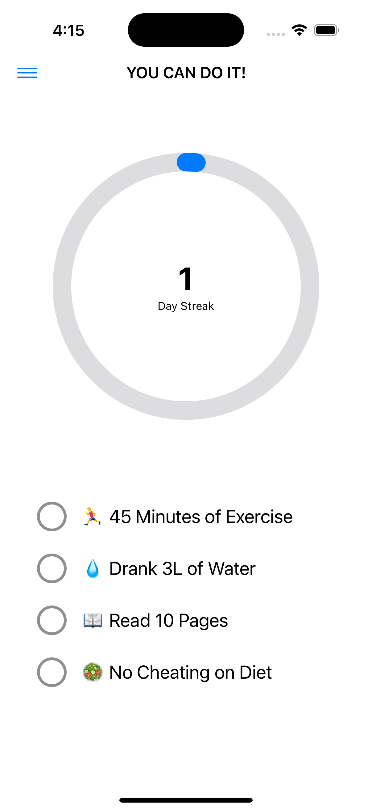
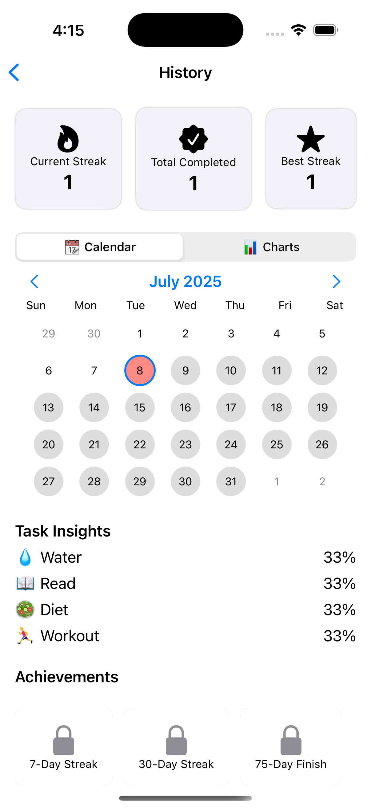

# 75Soft

75Soft is a 75-day discipline challenge app built with SwiftUI. It helps users build and track four daily healthy habits: hydration, reading, clean eating, and exercise. The app features an interactive checklist, streak tracking, rich history insights, configurable notifications, and Home Screen widgets.

---

## Features

- **Daily Checklist**  
  Mark off the following tasks each day: Drink 3 liters of water, read 10 pages of a book, follow a clean diet, complete a 45-minute workout.

- **Streak Tracking**  
  A streak counter that advances only when all tasks are completed in a single day. Users can choose to forgive a missed day or missed task.

- **Home Screen Widgets**  
  - Small progress widget shows current day count  
  - Small checklist widget shows today’s tasks  
  - Medium combined widget shows both progress and tasks

- **History & Insights**  
  - Interactive monthly calendar view of completed and missed days  
  - Line chart showing streak progression  
  - Completion rates for each task  
  - Achievement badges for 7-day, 30-day, and 75-day milestones

- **Onboarding Flow**  
  A multi-screen SwiftUI walkthrough that explains app purpose, tasks, marking logic, streak rules, and reset options.

- **Settings & Notifications**  
  - Toggle daily reminders and set reminder time  
  - Schedule milestone notifications when streak thresholds are reached  
  - Manual reset options for challenge and data  
  - Developer options for testing and debugging

---

## Technical Overview

- **User Interface**: SwiftUI, MVVM architecture  
- **Persistence**: SwiftData models (`@Model`, `@Query`)  
- **Widgets**: WidgetKit with App Group file sharing  
- **Charts**: Apple Charts framework  
- **Notifications**: `UNUserNotificationCenter` for local scheduling  
- **Onboarding**: `TabView` with `PageTabViewStyle` and custom animations

---

## Screenshots

<!--  Screenshots go here.  
> Add images under `docs/screenshots/` and reference them like below:

```markdown

 -->

